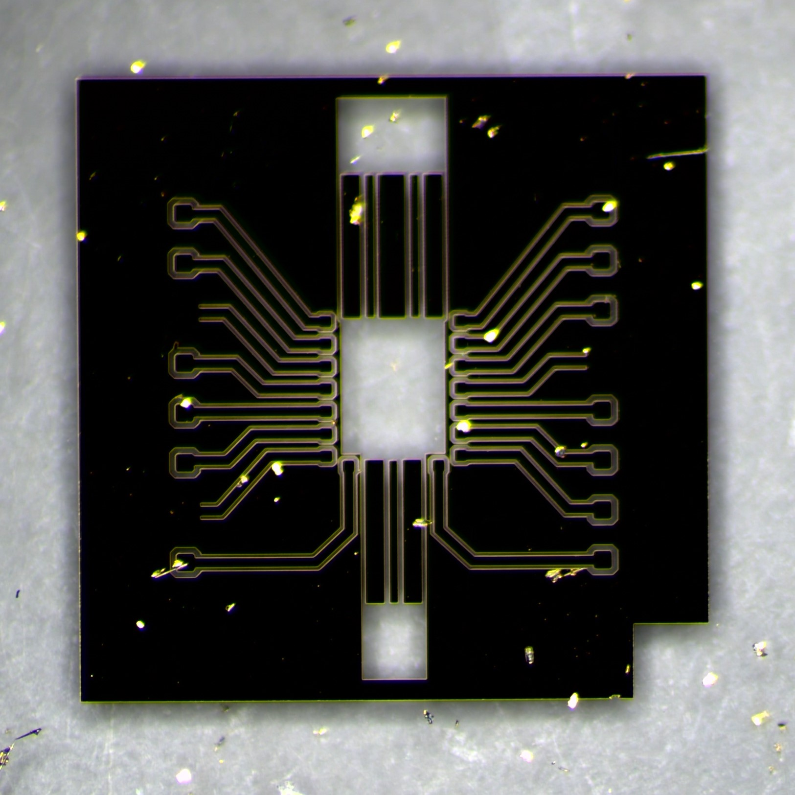

# EE4C01 Academic Writing Skills

Coursework for the TU Delft academic writing module (EE4C01), where a single research topic is built up across six assignments into a full IEEE-format literature review, with peer review along the way. The repository also holds the LaTeX source and figures for a separate published conference paper used as reference material.

## Course project: literature review on back-side power delivery

The graded thread is a literature review comparing front-side and back-side power delivery networks (BSPDN) at sub-5 nm CMOS nodes, assembled step by step:

| Assignment | Deliverable |
| --- | --- |
| 1 | Topic outline and annotated bibliography |
| 2 | Introduction and Method drafts |
| 3 | Full draft: front-side PDN limits, BSPDN improvements and limits |
| 4 | Peer review of another group (checklist, in-text feedback) |
| 5 | Revised paper after feedback |
| 6 | Final IEEE paper (`assignment6_5714699_5506387.pdf`) |

The methodology followed a screened IEEE Xplore search (2019 onward, buried power rails, PowerVia, nanoTSV, IR-drop) narrowed from 80+ hits to nine sources spanning early architecture proposals, Intel and imec demonstrations, and parasitic modelling. Each assignment folder keeps its LaTeX sections, bibliography, and the graded PDF; `assignment3/info/` collects the argumentation and structure guides used while writing.

## Reference paper: gold-bump flip-chip interposer (SIITME 2025)

`SIITME2025_Paper_08_Daniel/` contains the LaTeX source, figures, and references for a peer-reviewed conference paper (2025 IEEE 31st SIITME, Brasov):

> Development and Characterization of a Gold-Bump Flip-Chip Bonding Process for RF IC Applications

A single-layer Ti/Au ground-signal-ground coplanar-waveguide glass interposer, flip-chip bonded to a GaN chip with 70 μm thermosonic gold bumps, characterized broadband and reduced to a lumped-element bump model for PDK use.

The `figures/` and `references/` folders hold the de-embedding results (magnitude, phase, Smith chart), flip-chip process illustrations, bump thermal profiles, yield test structures, and the cited literature.

## Repository layout

| Path | Contents |
| --- | --- |
| `assignment1/` to `assignment6/` | Staged literature-review deliverables, LaTeX, feedback |
| `SIITME2025_Paper_08_Daniel/` | Conference paper source, figures, references |
| `IEEE_Conference_Template/` | IEEEtran template |
| `docs/`, `examples/`, `references/` | Course handouts, reference style guide, example reviews |
| `optional_assignment/` | U SPArC style exercise |

Notes files (`MY-RESEARCH-CONTEXT.md`, `GRADING-CRITERIA.md`, `IEEE-REFERENCE-GUIDE.md`) capture the working context and course requirements.
